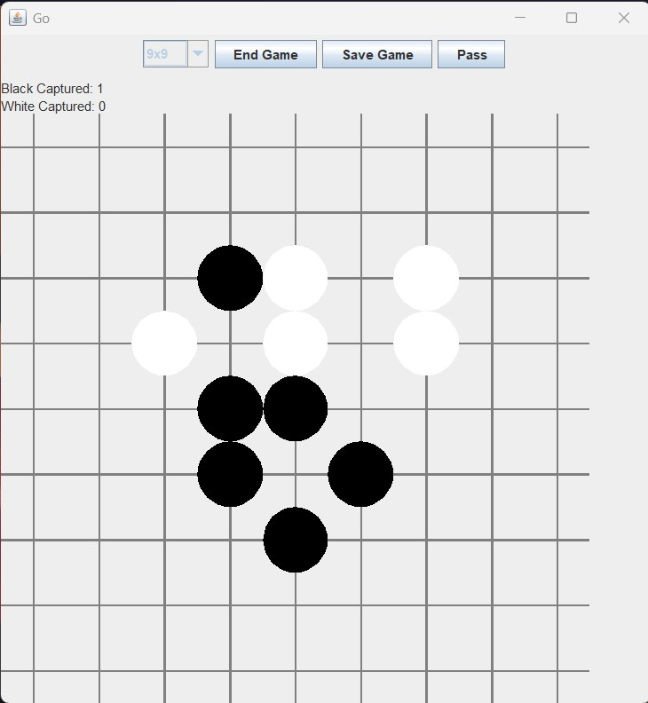
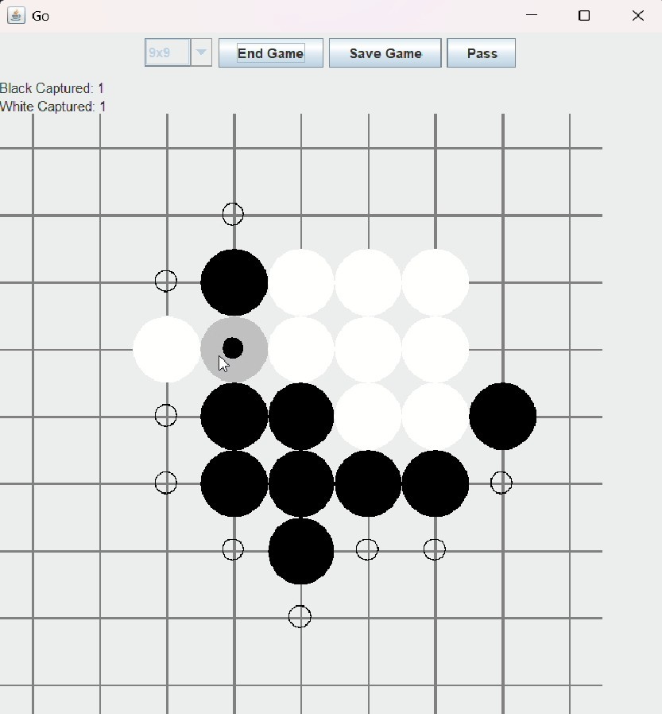
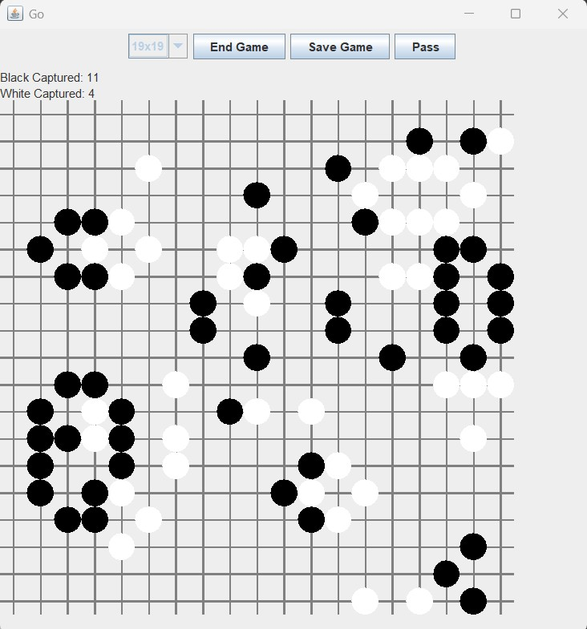

# <a href="https://en.wikipedia.org/wiki/Go_(game)">Go Game</a> – Java Implementation

This is a university assignment project developed as part of the **Advanced Java** course at Eötvös Loránd University during Fall 2024.

The task was to implement the logic of the traditional **Japanese board game "Go"** using **Java**, with strict limitations on which libraries and programming techniques could be used.

> 📌 Note: The **graphical user interface (GUI)** was provided by the instructors as a pre-built **Java Swing** application. I did not write the GUI code, I only connected it to my own logic.  
> 🧪 Some basic **JUnit 5** tests are also included.

---

## 📋 Assignment Summary

### Objectives

- Implement the logic of the Go board game.
- Follow strict coding rules: **no for-loops**, limited use of libraries (only `java.lang`, `java.io`, `java.util`, `java.util.function`, and `java.util.stream`), and functional programming style using **streams** and **lambdas**.
- Follow the rules of Go: three board sizes (9x9, 13x13, 19x19), correct handling of game-ending, captures, and Ko rule.
- Serializable game state (save/load to file).
- Implement unit tests using JUnit 5.

### Key Features

- Enum-based board sizes with textual representations.
- Enums for player stones and board spaces.
- `GoState` class as the main logic engine, handling:
  - Move validation (`isLegalMove`)
  - Capturing stones (`checkCaptured`)
  - Stone placement (`placeStone`)
  - Game history and Ko rule enforcement
  - Game saving and loading using Java serialization

---

## 💻 Technologies Used

- **Java**
- **Java Swing (provided GUI)**
- **JUnit 5** (for test cases)

---

## 🖼️ Screenshots

> These screenshots show the running Swing application connected to my Go game logic.

  
  
  

---

## 🧪 Testing

Unit tests for:
- Neighbor calculation
- Legal/illegal moves
- Group liberties
- Capturing mechanics
- Ko rule enforcement
- Game end after two passes
- Save/load consistency

JUnit 5 was used to create basic coverage for the above functionality.